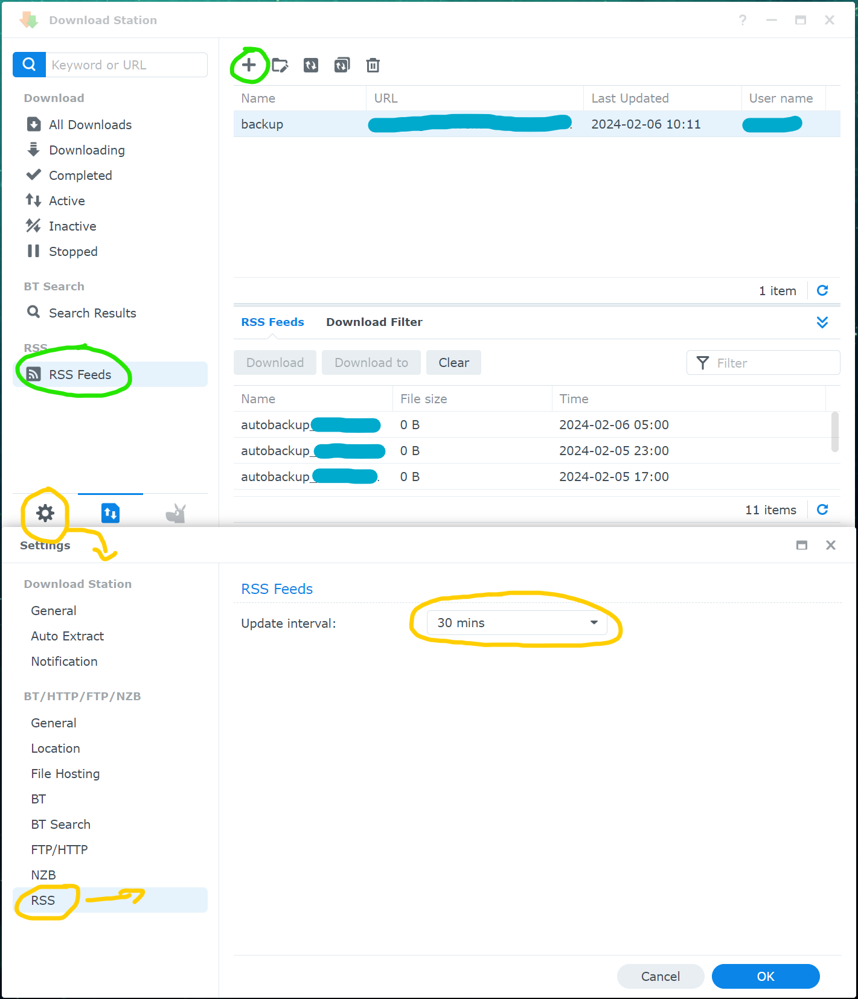
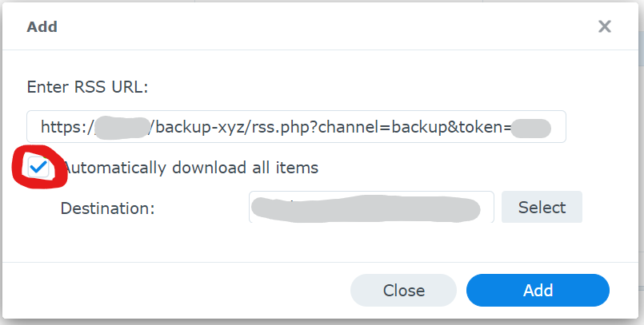

# Simple RSS directory index

This single php file serves the top-level index of a directory as an RSS feed.
The directory is selected via a query parameter.
A shared secret token offers means to hide the index from prying eyes.

It produces a very simple, compliant RSS feed which correctly validates with
[validator.w3.org/feed](https://validator.w3.org/feed/) (see example below).

## Motivation: Synology Download Station Backup

I needed a way to automate a simple backup for a remote server to my local NAS.
Since the server is only comfortably reachable via HTTP/S and I wanted a simple
solution, I looked into the built-in ingress tools of my Synology NAS (DSM).

Here I found a utility called [Download Station](https://www.synology.com/dsm/packages/DownloadStation).
Among many features it has a particularly interesting one: 
Subscribing to RSS feeds and autp-downloading their content.

### ⚠️ Security considerations

**Do not rely** on the token for security by obscurity!
This method **inherently exposes all files to the public** if the URL is known.

I suggest using an encryption tool, e.g. [GnuPG](https://www.gnupg.org/gph/en/manual/x110.html).
(PGP encryption has the advantage of automatically compressing your files, too.)
Remember to not encrypt in-place as the unencrypted data will be (at least briefly) accessible.

## Usage

1. Create/have a directory to serve via your favorite server (e.g. Apache, nginx).
2. Enable PHP support for the given directory (at least the index.php of this repo).

   *If you do not have absolute control over the files you will serve, make sure to
   only enable PHP to interpret this one file and not anything else by accident!*
3. Place the rss.php into this directory
4. Create one or more subdirectories (each will become one distinct feed)
5. Put a non-secret example file in one of the subdirectories and try if the rss works
   by opening the URL to your `rss.php` using the dummy token (see url schema below). 
6. Only after you are sure the PHP script is actually invoked and not just served as is:
   Change the `$ref_token` to an actual unique random key you keep secret
7. Add the RSS feed(s) to your Download Station, or where ever you want to use it. 

### URL Scheme

    https://your-server.com/non-obvious-path/rss.php?channel=SUBDIRNAME&token=SECRET

### Example feed

Serving this repository on localhost:8000 and opening 
http://localhost:8000/rss.php?channel=docs&token=PutYourSuperSecretTokenHere should yield:

```xml
<?xml version="1.0" encoding="utf-8"?>
<rss version="2.0" xmlns:atom="http://www.w3.org/2005/Atom">
    <channel>
        <title>docs</title>
        <link>http://localhost:7701</link>
        <description>Simple directory index feed</description>
        <atom:link href="http://localhost:7701/rss.php?channel=docs" rel="self" type="application/rss+xml" />
        <item>
            <title>dsm_dl_add.png</title>
            <link>http://localhost:7701/docs/dsm_dl_add.png</link>
            <guid>http://localhost:7701/docs/dsm_dl_add.png?mtime=1707212185</guid>
            <description>Size: 33661 Bytes</description>
            <pubDate>Tue, 06 Feb 2024 10:36:25 +0100</pubDate>
        </item>
        <item>
            <title>dsm_dl_feed.png</title>
            <link>http://localhost:7701/docs/dsm_dl_feed.png</link>
            <guid>http://localhost:7701/docs/dsm_dl_feed.png?mtime=1707211578</guid>
            <description>Size: 199541 Bytes</description>
            <pubDate>Tue, 06 Feb 2024 10:26:18 +0100</pubDate>
        </item>
    </channel>
</rss>
```

### Example screenshots of the Synology DSM [Download Station](https://www.synology.com/dsm/packages/DownloadStation)

Note: Make sure to enable auto download when adding the feed. Also check the update interval setting!

Tested with DSM 7.1.1



